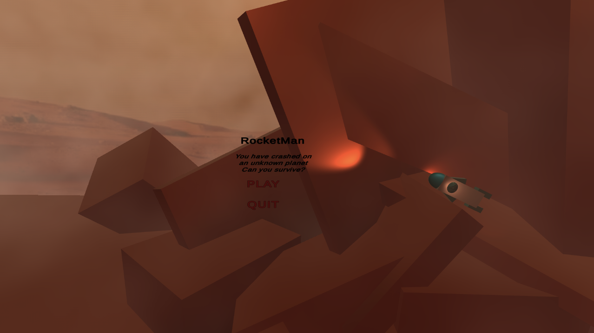
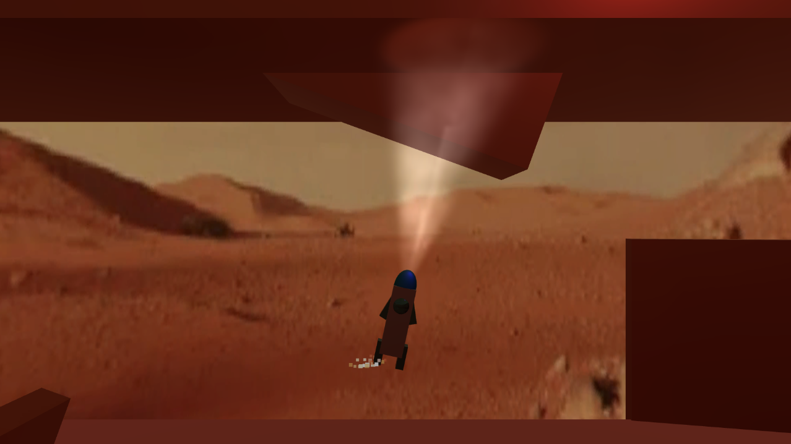
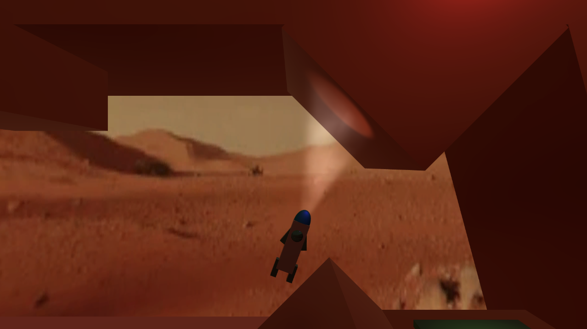

# RocketMan 
### Physics Control Level-Based Game
From 
['Complete C# Unity Game Developer 3D'](https://www.udemy.com/share/101Wey3@occDr7pKXv2cfZCobbnh2lkze5Pmjp_IYD8EG3oD64DJT-iMI25hix9VCl3EPx0T/) : Section 3

## Gameplay

## Features
- Input Binding
- Physics
- SFX
- Level Respawn
- Particle System
- Volumetric Lighting
- Moving Obstacles
